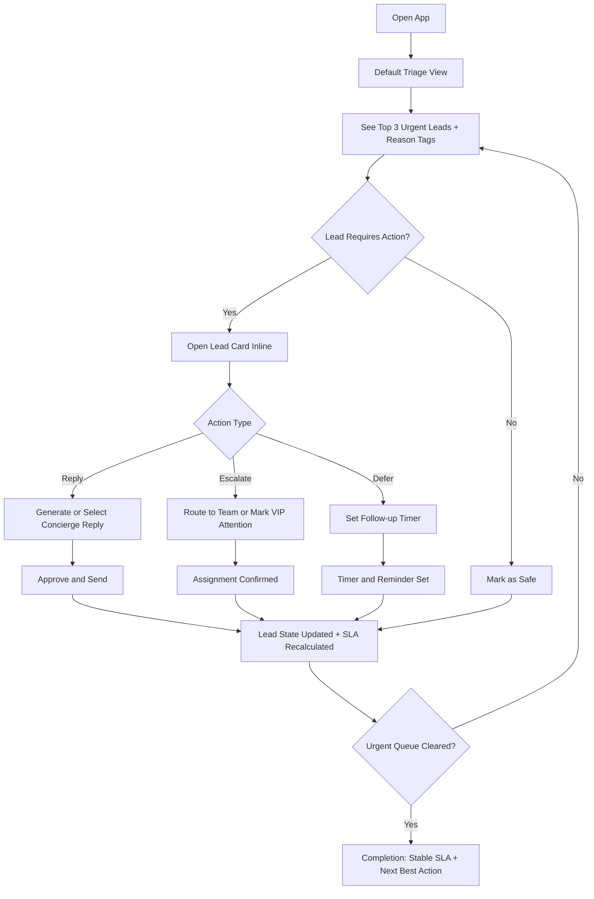
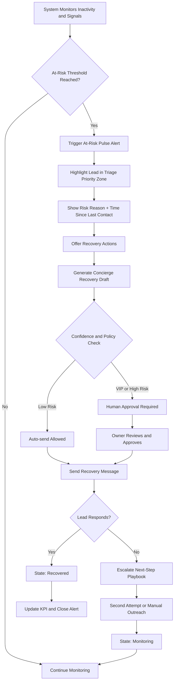
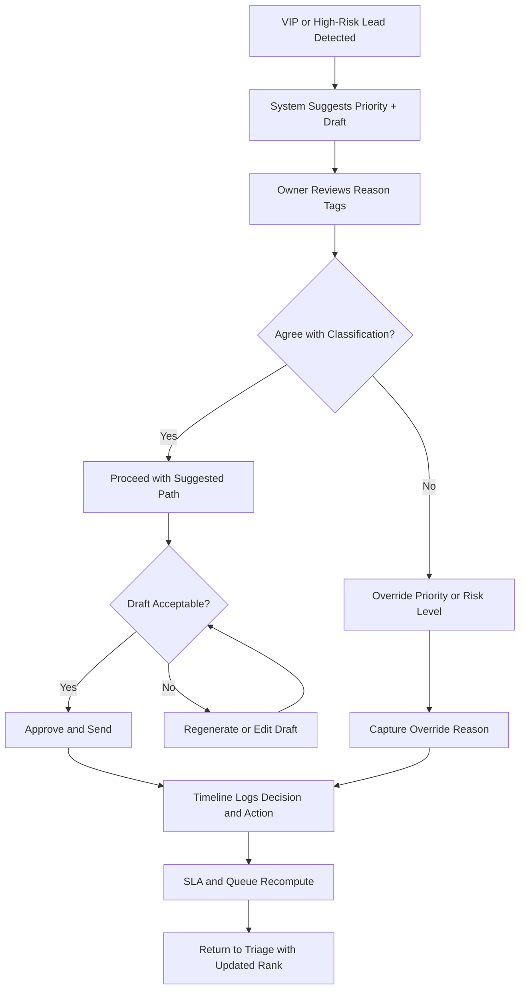

# UX Design Specification Proyecto Mistral Hackathon

**Author:** Rodri
**Date:** 2026-02-28

---

<!-- UX design content will be appended sequentially through collaborative workflow steps -->

## Executive Summary

### Project Vision

Proyecto Mistral Hackathon is a salon-focused AI lead operations platform designed to prevent revenue loss caused by delayed or missed follow-up. The UX vision is to give small salon teams a clear, fast, and reliable operating surface where they can instantly understand which conversations matter most and take the right action with confidence. The product should feel simple to use while still covering all operational requirements needed for daily lead management.

### Target Users

The primary users are small salon owners and managers (typically 2-5 staff) who work under constant multitasking pressure and cannot afford missed leads. They need rapid clarity, minimal cognitive load, and trustworthy AI guidance. The experience must be equally effective on both mobile and desktop, since users will operate across devices throughout the day.

### Key Design Challenges

The central UX challenge is designing a triage-first experience that is immediately understandable and actionable while still supporting deeper operational needs. The interface must balance speed and completeness: users should be able to process urgent leads quickly without losing context, while still accessing controls for approvals, overrides, and escalation handling. A second challenge is preserving behavioral consistency across mobile and desktop so workflows feel familiar regardless of device. A third challenge is preventing complexity creep as more operational capabilities are exposed.

### Design Opportunities

The main opportunity is to make the triage view a standout competitive advantage through clear prioritization, explainable urgency signals, and obvious next actions. Another opportunity is to use compact AI explainability cues to increase trust and decision confidence without adding friction. A third opportunity is building a highly efficient action loop (review, decide, respond) that lets salon owners move from insight to action in seconds, especially during high-pressure periods.

## Core User Experience

### Defining Experience

The core experience of Proyecto Mistral Hackathon is a triage-first operational loop where salon owners rapidly sort incoming leads, understand urgency, and execute clear messaging actions without friction. The product's value is delivered when users can move from inbox noise to confident prioritization in seconds, then act immediately on the highest-value conversations.

### Platform Strategy

The UX strategy is dual-platform by design: mobile and desktop must both support the same core triage behavior and mental model. Mobile supports fast in-between-task checks and action, while desktop supports higher-density review and operational control. For MVP, the product is online-only, enabling real-time prioritization, risk updates, and synchronized team context without offline complexity.

### Effortless Interactions

The interaction model should minimize user effort at every step. Sorting, filtering, and selecting urgent leads must require as few actions as possible. Clear messaging actions (review, approve, send, or route) should be directly accessible from triage surfaces without deep navigation. Users should not need to interpret complex states before acting; urgency, reason tags, and next actions should be immediately visible and actionable.

### Critical Success Moments

The primary success moment is when a user can identify the top 3 urgent leads in under 10 seconds. Additional success moments include quickly understanding why those leads are urgent and completing the first meaningful follow-up action with minimal interaction overhead. Any delay or ambiguity in triage ranking or next-step clarity is a make-or-break failure point for the experience.

### Experience Principles

- Prioritization First: Always surface urgency and value before secondary information.
- Minimum Interaction Cost: Reduce clicks/taps and eliminate unnecessary navigation in core workflows.
- Clarity Before Complexity: Present simple, readable messaging and explainability cues at decision time.
- Cross-Platform Consistency: Keep triage behavior and interaction logic aligned across mobile and desktop.
- Speed as UX Quality: Design for measurable rapid understanding, especially the "top 3 in under 10 seconds" benchmark.

## Desired Emotional Response

### Primary Emotional Goals

Proyecto Mistral Hackathon should make users feel in control, calm, and confident while handling lead operations under time pressure. The emotional core is operational composure: users should feel they can trust what they see, decide quickly, and act without second-guessing. The premium concierge tone should reinforce that they are delivering high-quality, attentive service, not just processing tasks.

### Emotional Journey Mapping

At first discovery, users should feel immediate clarity and reassurance that this is easy to understand. During the core triage flow, the dominant feelings should be calm control and decision confidence, even when urgency is high. After completing high-priority messaging actions, users should feel clear accomplishment and momentum. If something goes wrong, the system should create recovery confidence by making next steps obvious and safe. On return visits, users should feel familiar mastery and trust in the platform's consistency.

### Micro-Emotions

The most important micro-emotions are confidence over confusion, trust over skepticism, and accomplishment over frustration. A secondary emotional objective is low-friction satisfaction: users should feel that meaningful progress is happening quickly with minimal effort. Anxiety should be reduced by clear urgency signals and obvious recommended actions. The premium concierge style should add a subtle sense of pride in service quality.

### Design Implications

To support control, calm, and confidence, triage screens must prioritize visual clarity, stable hierarchy, and explicit next actions. To support accomplishment, core flows should provide immediate feedback when urgent leads are handled and visibly reduce outstanding risk. To express premium concierge tone, language and interaction details should feel polished, supportive, and high-touch without becoming verbose or decorative. Negative emotional triggers to avoid include ambiguous statuses, dense unreadable cards, and hidden critical actions.

### Emotional Design Principles

- Calm Under Pressure: Keep urgent workflows visually clear and cognitively light.
- Confidence Through Clarity: Explain priority decisions in concise, understandable terms.
- Accomplishment by Action: Make every critical action feel immediate and meaningful.
- Premium Service Feel: Use refined tone and interaction polish that suggests concierge-level care.
- Trust in Recovery: When issues occur, show clear, guided recovery paths without blame or friction.

## UX Pattern Analysis & Inspiration

### Inspiring Products Analysis

WhatsApp Business succeeds by minimizing friction in repetitive customer communication. Features like quick replies, labels, away messages, and catalog sharing reduce effort for high-frequency interactions. It keeps business context inside the conversation, enabling fast action under time pressure.

Fresha excels at operational clarity for salons through a unified scheduling surface, real-time updates, and automation (confirmations, reminders, and waitlist-style flow). It combines acquisition channels with booking execution, helping users move quickly from demand to confirmed appointments.

Google Business Profile is strong at top-of-funnel intent capture, turning search and map discovery into direct contact actions. It reduces steps between "I found this salon" and "I can message/book now," which is critical for conversion-sensitive businesses.

### Transferable UX Patterns

- Triage-first queue with explicit status labels and fast filtering.
- One-surface actioning: review context and execute next action without deep navigation.
- Prebuilt response acceleration (templates and quick replies) for common intents.
- Real-time operational feedback (confirmations, reminders, status updates) to reinforce trust and control.
- Multi-entry acquisition awareness (Google/social/chat) with centralized operational handling in one workspace.

### Anti-Patterns to Avoid

- Feature sprawl that hides priority actions behind multiple layers.
- Dense card layouts that increase cognitive load in urgent moments.
- Inconsistent behavior between mobile and desktop for the same core triage tasks.
- Over-reliance on any single external channel behavior that can change over time.
- Ambiguous urgency states without a clear reason and explicit next action.

### Design Inspiration Strategy

**What to Adopt**

- Fast message handling primitives (quick actions, labels, templates).
- Clear scheduling and priority surfaces with real-time state updates.
- Discovery-to-conversation continuity from external channels into the core triage workspace.

**What to Adapt**

- Messaging patterns adapted for high-value lead triage (reason tags and risk cues).
- Booking-style operational clarity adapted to lead recovery workflows.
- Acquisition channel entry points adapted to a concierge decision flow, not a generic inbox.

**What to Avoid**

- Generic CRM-style complexity in MVP.
- Excessive navigation depth for critical triage and messaging tasks.
- Any UX that compromises the "top 3 urgent leads in under 10 seconds" benchmark.

## Design System Foundation

### 1.1 Design System Choice

Proyecto Mistral Hackathon will use a themeable design system approach, with MUI as the foundational component library and a custom premium-concierge theme layer on top.

### Rationale for Selection

This approach provides the best balance between development speed and visual differentiation for hackathon constraints. It supports fast implementation with production-ready components while allowing a distinctive brand expression aligned with the premium concierge emotional goal. It also enables consistent interaction patterns across mobile and desktop, which is critical for the triage-first workflow and rapid decision-making UX.

### Implementation Approach

Start with MUI core components for layout, cards, tables and lists, inputs, badges, dialogs, and navigation primitives. Build the triage experience with reusable patterns (lead card, urgency badge, reason-tag chips, action cluster) and enforce shared behavior across breakpoints. Use responsive design tokens and component variants to keep mobile and desktop behavior consistent while adapting density and interaction affordances per device context. Keep the MVP online-first and optimize for low interaction cost in the core loop.

### Customization Strategy

Define a custom token layer (color, typography, spacing, elevation, motion, status semantics) to express a premium concierge identity rather than default Material styling. Create branded variants for high-value surfaces such as urgent lead cards, at-risk pulse indicators, and concierge action buttons. Apply strict visual hierarchy rules for triage clarity and enforce concise, confidence-building microcopy. Limit custom components to high-impact differentiators and rely on themed base components elsewhere to maintain speed and reduce implementation risk.

## 2. Core User Experience

### 2.1 Defining Experience

The defining experience in Proyecto Mistral Hackathon is a triage-first action loop: users open one prioritized workspace, immediately identify the top urgent leads, and execute clear messaging actions with minimal interaction cost. This is the core behavior users should describe to others because it turns operational chaos into fast, confident control.

### 2.2 User Mental Model

Users currently think in terms of "inbox urgency plus memory," not formal CRM workflows. They rely on WhatsApp plus spreadsheets and notebooks to remember who needs attention, which creates fragmentation and missed follow-up. Their expectation is simple: the system should tell them who matters now, why, and what to do next without forcing them through complex navigation.

### 2.3 Success Criteria

The core interaction is successful when users can identify the top 3 urgent leads in under 10 seconds and complete first meaningful action rapidly. They should feel "this just works" when ranking is clear, reason tags are understandable, and next actions are obvious. System feedback must be immediate: ranking updates instantly, lead status transitions are visible, and SLA risk state confirms whether they are safe or need action.

### 2.4 Novel UX Patterns

The experience should be built primarily on established inbox and queue UX patterns to minimize learning time. Innovation comes from combining familiar triage mechanics with a distinctive At-Risk Pulse pattern and concierge-style guided recovery actions. This "familiar foundation plus focused innovation" approach reduces onboarding friction while still creating clear product differentiation.

### 2.5 Experience Mechanics

**1. Initiation**
User opens the triage surface and lands on a ranked urgency view by default, with top urgent leads pinned to immediate attention.

**2. Interaction**
User scans urgency cards, checks concise reason tags, applies fast filters and sorting when needed, and triggers messaging actions directly from the same surface (review, approve or send, route or escalate).

**3. Feedback**
System responds in real time with updated ranking, state transitions, and SLA safety indicators. Mistakes or reversals are recoverable through clear override controls and guided next steps.

**4. Completion**
User knows they are done when urgent queue pressure is reduced, top leads are actioned, and SLA indicators show stable status. The system then guides the next highest-impact action to preserve momentum.

## Visual Design Foundation

### Color System

Proyecto Mistral Hackathon will use an Editorial Premium color system:
- Primary: #2D3A3A
- Accent: #B88A44
- Surface: #FAF7F2
- Text: #111111

Semantic mapping:
- Primary actions and key navigation use the Primary color.
- Premium highlights, concierge emphasis, and selected high-value accents use the Accent color.
- Default workspace and cards use the Surface color to maintain calm visual tone.
- Body and heading text use Text color for strong readability.

Status colors (success, warning, error, info) will be defined as semantic tokens and tuned to harmonize with the palette while preserving accessibility and urgency clarity.

### Typography System

Typography stack:
- Headings: Plus Jakarta Sans
- Body and UI text: Inter

Hierarchy strategy:
- Clear heading-to-body contrast for rapid scanning in triage interfaces.
- Body text optimized for operational readability and concise messaging.
- Consistent type scale across desktop and mobile to reduce cognitive switching cost.

Tone outcome:
- Professional and premium without sacrificing clarity.
- Supports concierge-like brand expression with fast decision support.

### Spacing & Layout Foundation

Spacing system:
- Base unit: 8px
- Density: balanced (efficient but not cramped)

Layout system:
- Desktop: 12-column grid
- Mobile: 4-column grid

Structural principles:
- Keep triage-critical information above the fold.
- Maintain stable card rhythm and predictable action placement.
- Preserve interaction consistency across breakpoints so users can act quickly on any device.

### Accessibility Considerations

- Target WCAG AA contrast compliance for all text and key interactive elements.
- Minimum body text size of 16px for readability under time pressure.
- Urgency and status communication must not rely on color alone; pair color with iconography and labels.
- Focus states, touch targets, and keyboard navigation should remain explicit and consistent across core workflows.

## Design Direction Decision

### Design Directions Explored

We explored six visual directions in the interactive showcase: Executive Radar, Concierge Inbox, Signal Board, Compact Pro, Premium Calm, and Hybrid Command. Each direction tested a different balance of hierarchy, density, interaction style, and premium-concierge expression while preserving triage-first decision speed.

### Chosen Direction

Chosen direction: Hybrid Command (Direction 6) as the base, with selective integration of Signal Board pulse emphasis (Direction 3) and Premium Calm spacing and tone cues (Direction 5).

### Design Rationale

Hybrid Command offers the strongest balance between rapid triage execution, cross-platform consistency, and premium brand expression. Signal Board elements reinforce the product's unique At-Risk Pulse mechanic without forcing unfamiliar interaction patterns. Premium Calm influence reduces cognitive load and supports the desired emotional state of calm confidence while maintaining clear actionability for urgent leads.

### Implementation Approach

Implement Direction 6 structure as the default layout system for desktop and mobile, then layer Direction 3 pulse treatments into risk and escalation surfaces only. Apply Direction 5 spacing rhythm, card breathing room, and restrained emphasis to prevent visual overload. Keep one-surface actioning, explicit reason tags, and immediate feedback states as non-negotiable interaction anchors across all core flows.

## User Journey Flows

### Daily Triage and Urgent Lead Action

This flow is the core owner loop: open triage, identify top urgent leads in under 10 seconds, and execute first meaningful messaging actions with immediate feedback.

### At-Risk Pulse Recovery Flow

This flow ensures that silent lead decay is detected and recovered through guided, premium-tone intervention with clear risk feedback.

### VIP Override and Approval Flow

This flow protects quality and trust in critical interactions by combining AI speed with explicit human control.

### Journey Patterns

- One-surface workflow: prioritize, decide, and act without deep navigation.
- Explainability at decision time: reason tags shown before action.
- Immediate system feedback: ranking, SLA state, and lead status update in real time.
- Human-in-the-loop guardrails: mandatory approval for VIP and high-risk actions.
- Recoverability by design: clear override and retry paths in every critical flow.

### Flow Optimization Principles

- Time-to-clarity first: optimize first 10 seconds for urgent ranking comprehension.
- Progressive disclosure: show only essential detail first, reveal advanced controls on demand.
- Action proximity: keep primary actions attached to lead cards and risk states.
- Error-safe operations: every critical action should be reversible or recoverable.
- Consistent cross-platform behavior: same interaction logic on desktop and mobile.

## Component Strategy

### Design System Components

Using MUI as the foundation, the following components are available out of the box and should be reused directly where possible:

- Layout and structure: `Container`, `Grid`, `Stack`, `Box`, `Paper`
- Navigation: `Tabs`, `Drawer`, `BottomNavigation`, `Breadcrumbs`
- Inputs and controls: `TextField`, `Select`, `Autocomplete`, `Checkbox`, `Switch`, `IconButton`
- Data display: `Card`, `Chip`, `Badge`, `Avatar`, `Tooltip`, `Table`, `List`
- Feedback and overlays: `Snackbar`, `Alert`, `Dialog`, `Menu`, `Popover`, `Skeleton`, `LinearProgress`

Gap analysis from the journey flows shows that the triage and risk-recovery domain requires custom components beyond generic MUI primitives:

- Triage-specific priority presentation and action clustering
- Risk pulse signaling with time-sensitive escalation behavior
- Concierge reply workflow orchestration with approval policy states
- SLA safety status and trend communication in compact form
- Auditability for override and approval actions

### Custom Components

### LeadPriorityCard

**Purpose:** Represent one lead in triage with priority context, explainability, and immediate action.  
**Usage:** Primary unit in triage queue on mobile and desktop.  
**Anatomy:** Lead identity, urgency level, reason tags, inactivity timer, SLA hint, quick actions.  
**States:** Default, hover, focused, selected, critical-at-risk, assigned, resolved, disabled.  
**Variants:** Compact (mobile), Standard (desktop), Expanded (with inline details).  
**Accessibility:** Landmark role in list, keyboard focus ring, action buttons with explicit `aria-label`s, screen-reader announcement for risk changes.  
**Content Guidelines:** Keep top line concise; max 2 primary reason tags before overflow.  
**Interaction Behavior:** Single click/tap opens inline action panel; primary action always visible.

### AtRiskPulseBanner

**Purpose:** Surface risk escalation clearly and prompt immediate recovery action.  
**Usage:** Appears at top of triage and inside high-risk lead context.  
**Anatomy:** Pulse indicator, risk cause, elapsed time, recommended next action, escalation CTA.  
**States:** Monitoring, escalated, acknowledged, resolved.  
**Variants:** Inline card banner, sticky top strip.  
**Accessibility:** Non-color urgency indicators (icon + text), polite live region for new alerts, keyboard actionable CTAs.  
**Content Guidelines:** Use plain language with one explicit next step.  
**Interaction Behavior:** CTA opens guided recovery flow; dismiss requires explicit acknowledge.

### ConciergeReplyComposer

**Purpose:** Generate, edit, approve, and send premium-tone replies with policy safeguards.  
**Usage:** Inline within lead context and modal fallback on smaller screens.  
**Anatomy:** Draft body, tone selector, suggestions, confidence marker, approve/send controls.  
**States:** Drafting, generated, edited, pending approval, sent, failed.  
**Variants:** Quick mode (one-click), Full mode (editor + rationale).  
**Accessibility:** Proper form labeling, keyboard shortcuts for approve/send, status updates announced to assistive tech.  
**Content Guidelines:** Keep suggested message concise and personalized; avoid jargon.  
**Interaction Behavior:** Supports regenerate, manual edit, and approval gate for VIP/high-risk.

### SLASafetyIndicator

**Purpose:** Communicate whether queue and lead-level SLA are safe or at risk.  
**Usage:** Triage header, lead cards, and detail panels.  
**Anatomy:** Status chip, trend arrow, time-to-breach metric.  
**States:** Safe, warning, breach-risk, breached, recovering.  
**Variants:** Inline chip, summary tile, compact badge.  
**Accessibility:** Uses text labels plus icon and color; includes readable numeric context.  
**Content Guidelines:** Prefer actionable phrasing ("3m to breach") over abstract status terms.  
**Interaction Behavior:** Clicking opens filtered list of affected leads.

### QueueFilterBar

**Purpose:** Provide rapid sorting and filtering for triage speed.  
**Usage:** Persistent top control in queue views.  
**Anatomy:** Filter chips, sort selector, quick presets, reset control.  
**States:** Default, filter-active, sort-active, loading, no-results.  
**Variants:** Horizontal desktop bar, collapsible mobile drawer trigger.  
**Accessibility:** Keyboard-operable chips and controls, clear selected-state announcements.  
**Content Guidelines:** Use short filter labels and expose count badges.  
**Interaction Behavior:** Applies instantly with no full-page reload.

### DecisionTimeline

**Purpose:** Show auditable history of AI suggestions, overrides, approvals, and sends.  
**Usage:** Lead detail and support/debug contexts.  
**Anatomy:** Timestamped events, actor, decision rationale, state transition.  
**States:** Normal, flagged, expanded event, empty timeline.  
**Variants:** Compact chronological list, detailed audit mode.  
**Accessibility:** Semantic ordered list, expandable details with proper `aria-expanded`.  
**Content Guidelines:** Event labels should be factual and concise.  
**Interaction Behavior:** Expandable entries; filter by event type.

### Component Implementation Strategy

- Build all custom components as composition layers on top of MUI primitives and shared theme tokens.
- Centralize domain tokens for priority, risk, SLA, and concierge tone to prevent visual drift.
- Enforce uniform interaction contracts: same CTA order, same focus behavior, same status language.
- Add Storybook stories (or equivalent) per component with state matrix and accessibility checks.
- Tie each component to at least one journey flow from Step 10 to keep implementation outcome-driven.

### Implementation Roadmap

**Phase 1 - Core Journey Components**

- `LeadPriorityCard` (critical for triage loop)
- `QueueFilterBar` (critical for top-3-in-10-seconds target)
- `SLASafetyIndicator` (critical for urgency confidence)

**Phase 2 - Risk and Recovery Components**

- `AtRiskPulseBanner` (critical for proactive recovery differentiation)
- `ConciergeReplyComposer` (critical for action speed and premium tone)

**Phase 3 - Governance and Support Components**

- `DecisionTimeline` (critical for trust, support diagnostics, and auditability)

**Delivery Rules**

- Ship Phase 1 before broad visual refinement.
- Validate each phase on both desktop and mobile interaction parity.
- Do not introduce new custom components unless tied to a documented journey need.

## UX Consistency Patterns

### Button Hierarchy

**Primary Actions**  
Use for highest-impact actions in each context (for example, `Approve and Send`, `Handle Urgent Lead`).  
Visual design: solid primary color (`#2D3A3A`) with high-contrast text.  
Behavior: only one primary action per interaction zone.

**Secondary Actions**  
Use for supportive actions (for example, `Review`, `Regenerate`, `Assign`).  
Visual design: outlined or tonal style with clear separation from primary action.

**Tertiary Actions**  
Use for low-priority contextual actions (for example, `View Timeline`, `Expand Details`).  
Visual design: text-forward button treatment with explicit hover and focus affordances.

**Destructive Actions**  
Use only for irreversible operations, with explicit confirmation and warning semantics.

### Feedback Patterns

**Success**  
Immediate inline confirmation plus optional snackbar.  
Example: "Reply sent. Lead moved to Monitoring."

**Warning**  
Use for approaching SLA breach or uncertain confidence; always include next recommended action.

**Error**  
Show concise cause plus direct recovery action (retry, edit, escalate).  
Never block user without a recovery path.

**Info**  
Use for non-critical guidance and explainability context (reason tags, model rationale).

**Global Rule**  
Feedback appears at the action location and is reflected in state and timeline.

### Form Patterns

**Input Structure**  
Label above field, helper text below, validation on blur and submit.

**Validation**  
Inline error copy in plain language, pointing to exact field and required fix.

**Composer Pattern**  
Concierge reply editor includes draft area, tone controls, confidence cue, and approval actions.

**Submission Behavior**  
Prevent duplicate submissions with loading states and temporary action lock.

### Navigation Patterns

**Primary Navigation**  
Single triage-first home with stable top-level destinations:
- Triage
- At-Risk
- Queue Insights
- Settings

**Context Navigation**  
Inline panels and drawers preferred over deep route jumps.

**Back Behavior**  
Return to previous triage context with filters and sorting preserved.

**Cross-Platform**  
Desktop uses persistent rail/header; mobile uses bottom navigation with contextual drawers.

### Additional Patterns

**Empty States**  
Explain why empty and what to do next.  
Example: "No urgent leads right now. Review warm opportunities."

**Loading States**  
Use skeletons for list/card placeholders and preserve layout to avoid jumpiness.

**Search and Filtering**  
Instant-apply filters with visible active chips and one-tap clear-all.

**Modal and Overlay**  
Reserve for high-focus tasks (approval, destructive confirmation, full reply editing on mobile).

**Accessibility Baseline**
- WCAG AA contrast targets
- Visible keyboard focus states
- Touch targets of at least 44px on mobile
- Color never used as sole status indicator
- Screen-reader-friendly announcements for risk and SLA updates

## Responsive Design & Accessibility

### Responsive Strategy

**Desktop (1024px+)**
- Use multi-column triage with persistent navigation and parallel context (queue + details + actions).
- Show richer density for power workflows while keeping the top-3 urgent block fixed and obvious.

**Tablet (768px-1023px)**
- Use touch-optimized split layout when space allows, with stacked fallback.
- Keep quick actions thumb-reachable and preserve triage-first ranking hierarchy.

**Mobile (320px-767px)**
- Prioritize urgent lead list first, with bottom navigation and contextual drawers.
- Keep one-surface actioning: open lead, read reason tags, execute action without deep page jumps.

### Breakpoint Strategy

- Mobile: 320-767
- Tablet: 768-1023
- Desktop: 1024+
- Approach: mobile-first with progressive enhancement for tablet and desktop density.
- Keep interaction logic consistent across breakpoints (same CTA order, states, and terminology).

### Accessibility Strategy

- Compliance target: WCAG 2.2 AA.
- Normal text contrast target: at least 4.5:1.
- Full keyboard operability for critical workflows.
- Screen reader compatibility through semantic structure and ARIA where needed.
- Touch targets at least 44x44px.
- Status signaling must combine color, icon, and text.

### Testing Strategy

**Responsive Testing**
- Validate on real iOS and Android phones, one tablet class, and desktop browsers (Chrome, Safari, Firefox, Edge).
- Test low-bandwidth and moderate-latency scenarios for triage responsiveness.

**Accessibility Testing**
- Automated checks (axe/Lighthouse) in CI.
- Manual keyboard-only flow validation.
- Screen reader checks (VoiceOver and NVDA baseline).
- Color-blind simulation for urgency and SLA states.

**User Validation**
- Validate the "top 3 urgent leads in under 10 seconds" scenario on desktop and mobile.

### Implementation Guidelines

- Use relative units (`rem`, `%`) and tokenized spacing/typography.
- Apply mobile-first media queries and avoid one-off breakpoint hacks.
- Keep focus indicators visible; never remove default focus without replacement.
- Prefer semantic HTML first; add ARIA only where semantics are insufficient.
- Ensure dynamic updates (risk pulse, SLA changes, send status) are announced accessibly.
- Preserve filter and sorting context across navigation transitions.
